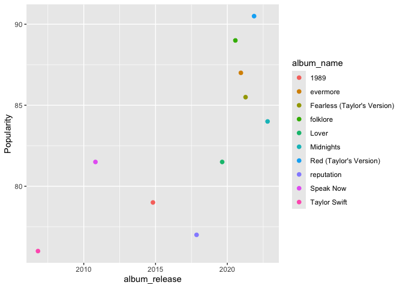
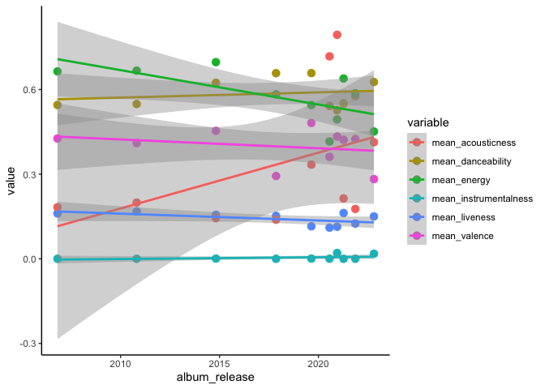

DSA2101 Group Project: Analysis of Taylor Swift Spotify Data
================

``` r
students <- data.frame(
  Group_Members = c("Chua Yong Sheng Joel", "Lim Zeen Kiat", "Robin Ghosh", "Timothy Teo Shao Jun"),
  Matriculation_Number = c("A_", "A0273151M", "A0271671A", "A0272851B")
)

kable(students, col.names = c("Group Members", "Matriculation Number"), 
      caption = "Student Information")
```

| Group Members        | Matriculation Number |
|:---------------------|:---------------------|
| Chua Yong Sheng Joel | A\_                  |
| Lim Zeen Kiat        | A0273151M            |
| Robin Ghosh          | A0271671A            |
| Timothy Teo Shao Jun | A0272851B            |

Student Information

``` r
# Load the Taylor Swift datasets
tuesdata <- tidytuesdayR::tt_load(2023, week = 42)
```

    ## ---- Compiling #TidyTuesday Information for 2023-10-17 ----
    ## --- There are 3 files available ---
    ## 
    ## 
    ## ── Downloading files ───────────────────────────────────────────────────────────
    ## 
    ##   1 of 3: "taylor_album_songs.csv"
    ##   2 of 3: "taylor_all_songs.csv"
    ##   3 of 3: "taylor_albums.csv"

``` r
taylor_album_songs <- tuesdata$taylor_album_songs
taylor_all_songs <- tuesdata$taylor_all_songs
taylor_albums <- tuesdata$taylor_albums

# Save each dataset to new CSV files
# write.csv(taylor_album_songs, "taylor_album_songs.csv", row.names = FALSE)
# write.csv(taylor_all_songs, "taylor_all_songs.csv", row.names = FALSE)
# write.csv(taylor_albums, "taylor_albums.csv", row.names = FALSE)
# >>>>>> e3542bd358543883b147a6664c5777a5ed2ce66e
```

=======

# Introduction

In this project, we aim to analyse Taylor Swift’s musical evolution
through her Spotify data. As one of the most popular music artists
globally, we aim to understand patterns and relationships in the musical
attributes of her songs and how these have defined her career. The
following table contains a brief description of the variables we have
chose to use for our project:

``` r
track_attributes <- data.frame(
  Variable = c(
    "album_name", "album_release", "track_name", "liveness", 
    "danceability", "energy", "loudness", "mode", "speechiness", 
    "acousticness", "instrumentalness", "valence", "tempo", "explicit"
  ),
  Class = c(
    "character", "double", "character", "double", "double", "double", "double", "integer",
    "double", "double", "double", "double", "double", "logical"
  ),
  Description = c(
    "Name of the album the track belongs to.",
    "Release date of the album.",
    "Name of the individual track.",
    "Measures the presence of an audience in the recording, with higher values indicating more 'live' sounds.",
    "Measures how suitable a track is for dancing, considering tempo, rhythm, and beat regularity.",
    "Measures the intensity and activity of a track, with higher values indicating more energetic sounds.",
    "The overall volume of the track, measured in decibels (dB).",
    "Indicates the modality of the track: 1 for major, 0 for minor.",
    "Measures the presence of spoken words in a track, with higher values indicating more speech-like content.",
    "Represents the likelihood that the track is acoustic, with higher values indicating more acoustic qualities.",
    "Predicts whether a track is instrumental, with higher values suggesting a lack of vocals.",
    "Describes the musical positiveness conveyed, with higher values indicating more cheerful and happy tones.",
    "The speed of the track, measured in beats per minute (BPM).",
    "Indicates whether the track contains explicit content: 1 for explicit, 0 for clean."
  )
)
kable(track_attributes, col.names = c("Variable", "Class", "Description"), align = "l")
```

| Variable | Class | Description |
|:---|:---|:---|
| album_name | character | Name of the album the track belongs to. |
| album_release | double | Release date of the album. |
| track_name | character | Name of the individual track. |
| liveness | double | Measures the presence of an audience in the recording, with higher values indicating more ‘live’ sounds. |
| danceability | double | Measures how suitable a track is for dancing, considering tempo, rhythm, and beat regularity. |
| energy | double | Measures the intensity and activity of a track, with higher values indicating more energetic sounds. |
| loudness | double | The overall volume of the track, measured in decibels (dB). |
| mode | integer | Indicates the modality of the track: 1 for major, 0 for minor. |
| speechiness | double | Measures the presence of spoken words in a track, with higher values indicating more speech-like content. |
| acousticness | double | Represents the likelihood that the track is acoustic, with higher values indicating more acoustic qualities. |
| instrumentalness | double | Predicts whether a track is instrumental, with higher values suggesting a lack of vocals. |
| valence | double | Describes the musical positiveness conveyed, with higher values indicating more cheerful and happy tones. |
| tempo | double | The speed of the track, measured in beats per minute (BPM). |
| explicit | logical | Indicates whether the track contains explicit content: 1 for explicit, 0 for clean. |

# Data Cleaning

Start off by filtering for the columns that we want:

``` r
taylor_album_songs <- taylor_album_songs %>%
    select(album_name, album_release, track_name, liveness, danceability, energy, loudness, mode, speechiness, acousticness, instrumentalness, valence, tempo, explicit)

taylor_all_songs <- taylor_all_songs %>%
    select(album_name, album_release, track_name, liveness, danceability, energy, loudness, mode, speechiness, acousticness, instrumentalness, valence, tempo, explicit)

taylor_albums <- taylor_albums %>%
    select(!ep)
```

Group by albums:

``` r
taylor_album_songs <- taylor_album_songs %>%
  group_by(album_name)

taylor_all_songs <- taylor_all_songs %>%
  group_by(album_name)

taylor_albums <- taylor_albums %>%
  group_by(album_name)
```

Checking for NA values in each file:

``` r
taylor_album_songs_na_count <- sapply(taylor_album_songs, function(x) sum(is.na(x)))
print(taylor_album_songs_na_count)
```

    ##       album_name    album_release       track_name         liveness 
    ##                0                0                0                3 
    ##     danceability           energy         loudness             mode 
    ##                3                3                3                3 
    ##      speechiness     acousticness instrumentalness          valence 
    ##                3                3                3                3 
    ##            tempo         explicit 
    ##                3                3

``` r
taylor_all_songs_na_count <- sapply(taylor_all_songs, function(x) sum(is.na(x)))
print(taylor_all_songs_na_count)
```

    ##       album_name    album_release       track_name         liveness 
    ##               27               27                0               11 
    ##     danceability           energy         loudness             mode 
    ##               11               11               11               11 
    ##      speechiness     acousticness instrumentalness          valence 
    ##               11               11               11               11 
    ##            tempo         explicit 
    ##               11               11

``` r
taylor_albums_na_count <- sapply(taylor_albums, function(x) sum(is.na(x)))
print(taylor_albums_na_count)
```

    ##       album_name    album_release metacritic_score       user_score 
    ##                0                0                2                2

There are many occurences of NA data present. Hence, we will need to
remove them:

``` r
taylor_album_songs <- taylor_album_songs %>%
    na.omit()

taylor_all_songs <- taylor_all_songs %>%
    na.omit()

taylor_albums <- taylor_albums %>%
    na.omit()
```

Save cleaned data as new files:

``` r
write.csv(taylor_album_songs, "CSV files/taylor_album_songs_cleaned.csv", row.names = FALSE)
write.csv(taylor_all_songs, "CSV files/taylor_all_songs_cleaned.csv", row.names = FALSE)
write.csv(taylor_albums, "CSV files/taylor_albums.csv_cleaned", row.names = FALSE)
```

``` r
head(taylor_album_songs)
```

    ## # A tibble: 6 × 14
    ## # Groups:   album_name [1]
    ##   album_name   album_release track_name    liveness danceability energy loudness
    ##   <chr>        <date>        <chr>            <dbl>        <dbl>  <dbl>    <dbl>
    ## 1 Taylor Swift 2006-10-24    Tim McGraw      0.121         0.58   0.491    -6.46
    ## 2 Taylor Swift 2006-10-24    Picture To B…   0.0962        0.658  0.877    -2.10
    ## 3 Taylor Swift 2006-10-24    Teardrops On…   0.119         0.621  0.417    -6.94
    ## 4 Taylor Swift 2006-10-24    A Place In T…   0.32          0.576  0.777    -2.88
    ## 5 Taylor Swift 2006-10-24    Cold As You     0.123         0.418  0.482    -5.77
    ## 6 Taylor Swift 2006-10-24    The Outside     0.24          0.589  0.805    -4.06
    ## # ℹ 7 more variables: mode <dbl>, speechiness <dbl>, acousticness <dbl>,
    ## #   instrumentalness <dbl>, valence <dbl>, tempo <dbl>, explicit <lgl>

``` r
head(taylor_all_songs)
```

    ## # A tibble: 6 × 14
    ## # Groups:   album_name [1]
    ##   album_name   album_release track_name    liveness danceability energy loudness
    ##   <chr>        <date>        <chr>            <dbl>        <dbl>  <dbl>    <dbl>
    ## 1 Taylor Swift 2006-10-24    Tim McGraw      0.121         0.58   0.491    -6.46
    ## 2 Taylor Swift 2006-10-24    Picture To B…   0.0962        0.658  0.877    -2.10
    ## 3 Taylor Swift 2006-10-24    Teardrops On…   0.119         0.621  0.417    -6.94
    ## 4 Taylor Swift 2006-10-24    A Place In T…   0.32          0.576  0.777    -2.88
    ## 5 Taylor Swift 2006-10-24    Cold As You     0.123         0.418  0.482    -5.77
    ## 6 Taylor Swift 2006-10-24    The Outside     0.24          0.589  0.805    -4.06
    ## # ℹ 7 more variables: mode <dbl>, speechiness <dbl>, acousticness <dbl>,
    ## #   instrumentalness <dbl>, valence <dbl>, tempo <dbl>, explicit <lgl>

``` r
head(taylor_albums)
```

    ## # A tibble: 6 × 4
    ## # Groups:   album_name [6]
    ##   album_name   album_release metacritic_score user_score
    ##   <chr>        <date>                   <dbl>      <dbl>
    ## 1 Taylor Swift 2006-10-24                  67        8.5
    ## 2 Fearless     2008-11-11                  73        8.4
    ## 3 Speak Now    2010-10-25                  77        8.6
    ## 4 Red          2012-10-22                  77        8.5
    ## 5 1989         2014-10-27                  76        8.2
    ## 6 reputation   2017-11-10                  71        8.3

``` r
names(taylor_album_songs)==names(taylor_all_songs)
```

    ##  [1] TRUE TRUE TRUE TRUE TRUE TRUE TRUE TRUE TRUE TRUE TRUE TRUE TRUE TRUE

``` r
checking_conflicts <- taylor_album_songs %>% anti_join(taylor_all_songs, by=names(taylor_all_songs))
head(checking_conflicts)
```

    ## # A tibble: 0 × 14
    ## # Groups:   album_name [0]
    ## # ℹ 14 variables: album_name <chr>, album_release <date>, track_name <chr>,
    ## #   liveness <dbl>, danceability <dbl>, energy <dbl>, loudness <dbl>,
    ## #   mode <dbl>, speechiness <dbl>, acousticness <dbl>, instrumentalness <dbl>,
    ## #   valence <dbl>, tempo <dbl>, explicit <lgl>

All the column names match for both tables. A tibble of no elements was
generated, thus confirming that all rows are present in either tables.
Since we can choose which table we want, we will use taylor_album_songs.

Next, since we are trying to compare popularity statistics by album, we
need to check which albums are present in `taylor_album_songs` and
`taylor_albums`.

``` r
names1 <- taylor_albums %>% select(album_name) %>% unique() %>% arrange(album_name)
names2 <- taylor_album_songs %>% select(album_name) %>% unique() %>% arrange(album_name)

comp_table=left_join(names1, names2, by=c("album_name"))

combined_table = rep(NA,length(comp_table$album_name))

for (i in 1:length(names1$album_name) ){
  if (names1$album_name[i] %in% names2$album_name) {
    combined_table[i] <- comp_table$album_name[i]
  }
}

combined_table = cbind(names1$album_name,combined_table)
knitr::kable(combined_table, col.names = c("Taylor Albums","Taylor Album Songs"), caption="Comparison of album names between the tables")
```

| Taylor Albums               | Taylor Album Songs          |
|:----------------------------|:----------------------------|
| 1989                        | 1989                        |
| Fearless                    | NA                          |
| Fearless (Taylor’s Version) | Fearless (Taylor’s Version) |
| Lover                       | Lover                       |
| Midnights                   | Midnights                   |
| Red                         | NA                          |
| Red (Taylor’s Version)      | Red (Taylor’s Version)      |
| Speak Now                   | Speak Now                   |
| Taylor Swift                | Taylor Swift                |
| evermore                    | evermore                    |
| folklore                    | folklore                    |
| reputation                  | reputation                  |

Comparison of album names between the tables

Checking the table generated, Fearless and Red do not appear in Taylor
Album Songs, thus they will not be considered for popularity comparison.
Next, we will aggregate statistics for each of the musical attributes by
taking their mean. Then, we will combine `taylor_album_songs` and
`taylor_albums` to tie the popularity metrics with each common album.

``` r
taylor_album_summary <- taylor_album_songs %>% group_by(album_name)%>% summarize(
  mean_loudness = mean(loudness),
  mean_danceability = mean(danceability),
  mean_liveness = mean(liveness),
  mean_energy = mean(energy),
  mean_mode = round(mean(mode)),
  mean_speechiness = mean(speechiness),
  mean_acousticness = mean(acousticness),
  mean_instrumentalness = mean(instrumentalness),
  mean_valence = mean(valence),
  mean_tempo = mean(tempo)
) %>% inner_join(taylor_albums, by=c("album_name")) %>% relocate(album_release, .after=album_name)
```

Metacritic scores and User scores are representative of the popularity
of the albums because they are averaged ratings of the albums from
critics and the public respectively (Source: NEED SOURCE metacritic.com,
another one).

Metacritic score ranges from 0 to 100 while User Score ranges from 0 to
10. We will aggregate these into one statistic, “Popularity”, weighted
by their respective ranges. (Source: NEED SOURCE)

Hence we use the following formula: Popularity =
(metacritic_score+(user_score\*10))/2

``` r
taylor_album_summary <- taylor_album_summary %>% mutate(Popularity = (metacritic_score+user_score*10)/2)
taylor_album_summary[, c(1,2,12)]
```

    ## # A tibble: 10 × 3
    ##    album_name                  album_release mean_tempo
    ##    <chr>                       <date>             <dbl>
    ##  1 1989                        2014-10-27          131.
    ##  2 Fearless (Taylor's Version) 2021-04-09          131.
    ##  3 Lover                       2019-08-23          120.
    ##  4 Midnights                   2022-10-21          120.
    ##  5 Red (Taylor's Version)      2021-11-12          124.
    ##  6 Speak Now                   2010-10-25          140.
    ##  7 Taylor Swift                2006-10-24          126.
    ##  8 evermore                    2020-12-11          121.
    ##  9 folklore                    2020-07-24          120.
    ## 10 reputation                  2017-11-10          128.

# 3. Visualisations

Exploratory plots: May or may not use, just to select

``` r
points = lm(data=taylor_album_summary, album_release~Popularity)
ggplot(taylor_album_summary, aes(x=album_release, y=Popularity, color=album_name)) +
  geom_point(size=2) 
```

<!-- -->

``` r
plotting = taylor_album_summary %>% pivot_longer(cols =c(mean_liveness, mean_danceability, mean_energy, mean_acousticness, mean_instrumentalness, mean_valence), names_to="variable", values_to="value")
ggplot(plotting, aes(x=album_release, y=value, color = variable)) +
  geom_point(size=3) +
  geom_smooth(method="lm") +
  theme_classic()
```

    ## `geom_smooth()` using formula = 'y ~ x'

<!-- -->

``` r
ggplot(taylor_album_summary, aes(x=album_release, y=mean_loudness)) +
  geom_point(size=3) +
  geom_smooth(method="lm") +
  theme_classic()
```

    ## `geom_smooth()` using formula = 'y ~ x'

<!-- -->

Valence dropped, songs became sadder. Instrumentalness dropped, songs
became more vocally driven. Acousticness increased sharply, songs
involved lesser electronic sounds and sounded more raw. Energy of the
tracks have also reduced, further emphasising the mellow trend of her
music. Though, it appears that danceability has increased, meaning that
the downbeats in her songs have become more pronounced, creating a
danceable vibe. It seems that Taylor Swift aims to be more intimate with
her audience while maintaining vibe and groove to make up for the lack
of energy. Her popularity has increased over the years also, signalling
the yearn for such music.

# :::

:::
