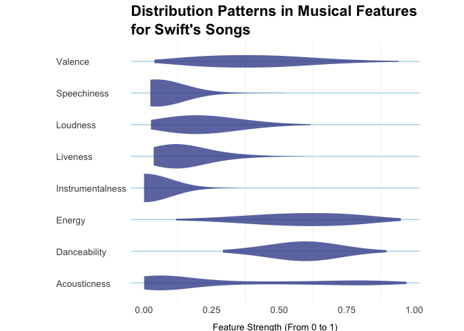
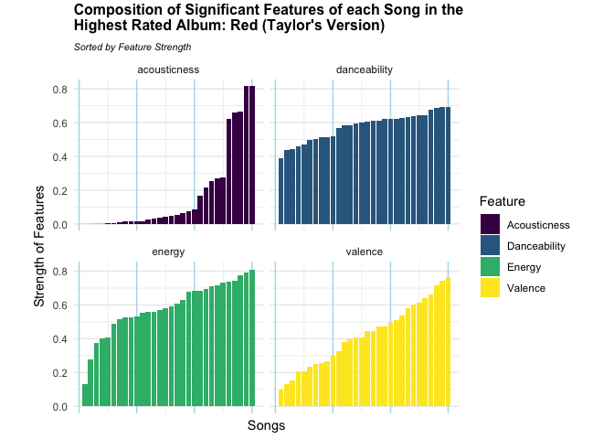

DSA2101 Group Project: Analysis of Taylor Swift Spotify Data
================

## Group members

| Group Members        | Matriculation Number |
|:---------------------|:---------------------|
| Chua Yong Sheng Joel | A0282307H            |
| Lim Zeen Kiat        | A0273151M            |
| Robin Ghosh          | A0271671A            |
| Timothy Teo Shao Jun | A0272851B            |

## Loading Data

``` r
# Load the Taylor Swift datasets
tuesdata <- tidytuesdayR::tt_load(2023, week = 42)
```

    ## ---- Compiling #TidyTuesday Information for 2023-10-17 ----
    ## --- There are 3 files available ---
    ## 
    ## 
    ## ── Downloading files ───────────────────────────────────────────────────────────
    ## 
    ##   1 of 3: "taylor_album_songs.csv"
    ##   2 of 3: "taylor_all_songs.csv"
    ##   3 of 3: "taylor_albums.csv"

``` r
taylor_album_songs <- tuesdata$taylor_album_songs
taylor_all_songs <- tuesdata$taylor_all_songs
taylor_albums <- tuesdata$taylor_albums

# Save each dataset to new CSV files
# write.csv(taylor_album_songs, "taylor_album_songs.csv", row.names = FALSE)
# write.csv(taylor_all_songs, "taylor_all_songs.csv", row.names = FALSE)
# write.csv(taylor_albums, "taylor_albums.csv", row.names = FALSE)
```

=======

## 1. Introduction

Taylor Swift’s music has had a significant impact on the global pop and
country music scene. In this project, we used the Taylor Swift Spotify
data sourced from the TidyTuesday repository (Harmon, 2023) to analyse
the musical and lyrical features of her music. This dataset includes
detailed audio attributes of her songs which we aim to use. By exploring
the given data, we aim to discover the patterns that have emerged
throughout Taylor Swift’s career and gain insights into how her music
has evolved.

### Brief description of the Dataset

`taylor_album_songs` ~ Song features and *metadata* for only songs
released in albums.

`taylor_all_songs` ~ Song features and *metadata* for all songs released
by Artist

`taylor_albums` ~ *Metadata* for each album, together with Metacritic
and User Scores (Used as receptivity metrics).

- **Metadata** refers to technical aspects of the release like track
  name, track number and release dates.
- Download dataset from:
  <https://github.com/rfordatascience/tidytuesday/blob/master/data/2023/2023-10-17/readme.md>

For our project, we aim to answer the following question:

``` bash
"How have changes in musical and lyrical features in Taylor Swift's songs resonated with her audience?" 
```

This analysis will allow us to identify trends in musical
characteristics and examine how stylistic changes in her songs which
have affected the receptivity of her music to her audience. We also hope
to understand her audience better by knowing their music preferences
through this study. Hence, we can perhaps understand what makes Taylor
Swift so popular.

## 2. Data Cleaning & Summary

### Summary of relevant statistics

The following table contains a brief description of the variables we
have chosen to use for our project (Harmon, 2023): These features will
enable us to compare the songs’ descriptive features through a
quantitative lense, allowing us to make judgements backed by figures.

| Variable | Class | Description |
|:---|:---|:---|
| album_name | character | Name of the album the track belongs to. |
| album_release | double | Release date of the album. |
| track_name | character | Name of the individual track. |
| danceability | double | Measures how suitable a track is for dancing. |
| energy | double | Measures the intensity and activity of a track, with higher values indicating more energetic sounds. |
| loudness | double | The overall volume of the track, measured in decibels (dB). |
| mode | integer | This is a categorical variable. It indicates the modality of the track: 1 for major, 0 for minor. |
| speechiness | double | Measures the presence of spoken words in a track, with higher values indicating more speech-like content. |
| acousticness | double | Represents the likelihood that the track is acoustic, with higher values indicating more acoustic qualities. |
| instrumentalness | double | Predicts whether a track is instrumental, with higher values suggesting a lack of vocals. |
| liveness | double | Measures the presence of an audience in the recording, with higher values indicating a stronger likelihood that the track is live |
| valence | double | Describes the musical positiveness conveyed, with higher values indicating more cheerful and happy tones. |
| tempo | double | The speed of the track, measured in beats per minute (BPM). |
| explicit | logical | Indicates whether the track contains explicit content: 1 for explicit, 0 otherwise. |
| Metacritic Score | double | Average score of the album obtained from critics at Metacritic.com |
| User Score | double | Average score of the album obtained from average users at Meatcritic.com |

### Data cleaning

We’ll start off by filtering for the features listed above. We do not
need the “EP” flag as well because we are interested in **all** the
songs in her albums which are present in `taylor_albums`.

``` r
taylor_album_songs <- taylor_album_songs %>%
  select(album_name, album_release, track_number, track_name, danceability, energy, loudness, mode, speechiness, acousticness, instrumentalness, liveness, valence, tempo, explicit)

taylor_all_songs <- taylor_all_songs %>%
  select(album_name, album_release, track_number, track_name, danceability, energy, loudness, mode, speechiness, acousticness, instrumentalness, liveness, valence, tempo, explicit)

taylor_albums <- taylor_albums %>%
  select(!ep)
```

Then, we group the data by their **respective albums** for aggregating
album data:

``` r
taylor_album_songs <- taylor_album_songs %>%
  group_by(album_name)

taylor_all_songs <- taylor_all_songs %>%
  group_by(album_name)

taylor_albums <- taylor_albums %>%
  group_by(album_name)
```

We will check and remove NA values in the data, which are not needed for
our visualisations:

``` r
taylor_album_songs_na_count <- sapply(taylor_album_songs, function(x) sum(is.na(x)))
print(taylor_album_songs_na_count)
```

    ##       album_name    album_release     track_number       track_name 
    ##                0                0                0                0 
    ##     danceability           energy         loudness             mode 
    ##                3                3                3                3 
    ##      speechiness     acousticness instrumentalness         liveness 
    ##                3                3                3                3 
    ##          valence            tempo         explicit 
    ##                3                3                3

``` r
taylor_all_songs_na_count <- sapply(taylor_all_songs, function(x) sum(is.na(x)))
print(taylor_all_songs_na_count)
```

    ##       album_name    album_release     track_number       track_name 
    ##               27               27               27                0 
    ##     danceability           energy         loudness             mode 
    ##               11               11               11               11 
    ##      speechiness     acousticness instrumentalness         liveness 
    ##               11               11               11               11 
    ##          valence            tempo         explicit 
    ##               11               11               11

``` r
taylor_albums_na_count <- sapply(taylor_albums, function(x) sum(is.na(x)))
print(taylor_albums_na_count)
```

    ##       album_name    album_release metacritic_score       user_score 
    ##                0                0                2                2

``` r
taylor_album_songs <- taylor_album_songs %>%
  na.omit()

taylor_all_songs <- taylor_all_songs %>%
  na.omit()

taylor_albums <- taylor_albums %>%
  na.omit()
```

Next we will check if data presented by `taylor_album_songs` and
`taylor_all_songs` are the same, in case we are missing crucial
differences.

``` r
names(taylor_album_songs) == names(taylor_all_songs)
```

    ##  [1] TRUE TRUE TRUE TRUE TRUE TRUE TRUE TRUE TRUE TRUE TRUE TRUE TRUE TRUE TRUE

``` r
checking_conflicts_left <- taylor_album_songs %>% anti_join(taylor_all_songs, by = names(taylor_all_songs))
glimpse(checking_conflicts_left)
```

    ## Rows: 0
    ## Columns: 15
    ## Groups: album_name [0]
    ## $ album_name       <chr> 
    ## $ album_release    <date> 
    ## $ track_number     <dbl> 
    ## $ track_name       <chr> 
    ## $ danceability     <dbl> 
    ## $ energy           <dbl> 
    ## $ loudness         <dbl> 
    ## $ mode             <dbl> 
    ## $ speechiness      <dbl> 
    ## $ acousticness     <dbl> 
    ## $ instrumentalness <dbl> 
    ## $ liveness         <dbl> 
    ## $ valence          <dbl> 
    ## $ tempo            <dbl> 
    ## $ explicit         <lgl>

``` r
checking_conflicts_right <- taylor_all_songs %>% anti_join(taylor_album_songs, by = names(taylor_album_songs))
glimpse(checking_conflicts_right)
```

    ## Rows: 47
    ## Columns: 15
    ## Groups: album_name [3]
    ## $ album_name       <chr> "Fearless", "Fearless", "Fearless", "Fearless", "Fear…
    ## $ album_release    <date> 2008-11-11, 2008-11-11, 2008-11-11, 2008-11-11, 2008…
    ## $ track_number     <dbl> 1, 2, 3, 4, 5, 6, 7, 8, 9, 10, 11, 12, 13, 14, 15, 16…
    ## $ track_name       <chr> "Fearless", "Fifteen", "Love Story", "Hey Stephen", "…
    ## $ danceability     <dbl> 0.598, 0.559, 0.618, 0.843, 0.585, 0.687, 0.498, 0.60…
    ## $ energy           <dbl> 0.714, 0.636, 0.736, 0.553, 0.346, 0.771, 0.486, 0.85…
    ## $ loudness         <dbl> -4.397, -4.400, -3.937, -7.348, -8.014, -4.424, -7.38…
    ## $ mode             <dbl> 1, 1, 1, 1, 1, 1, 1, 1, 1, 1, 1, 1, 1, 1, 1, 1, 1, 1,…
    ## $ speechiness      <dbl> 0.0273, 0.0263, 0.0308, 0.0317, 0.0256, 0.0384, 0.027…
    ## $ acousticness     <dbl> 0.036400, 0.072800, 0.157000, 0.168000, 0.302000, 0.1…
    ## $ instrumentalness <dbl> 1.04e-06, 0.00e+00, 0.00e+00, 2.66e-06, 0.00e+00, 2.4…
    ## $ liveness         <dbl> 0.3100, 0.1440, 0.0730, 0.1070, 0.1020, 0.1120, 0.113…
    ## $ valence          <dbl> 0.467, 0.214, 0.307, 0.825, 0.195, 0.445, 0.170, 0.51…
    ## $ tempo            <dbl> 99.979, 95.485, 118.982, 115.997, 92.564, 129.964, 14…
    ## $ explicit         <lgl> FALSE, FALSE, FALSE, FALSE, FALSE, FALSE, FALSE, FALS…

``` r
checking_conflicts_right$album_name %>% unique
```

    ## [1] "Fearless"                            "Red"                                
    ## [3] "The Taylor Swift Holiday Collection"

All the column names match for both tables. There were no non-matching
songs in `taylor_album_songs` to `taylor_all_songs`. However, there were
3 albums: “Fearless”, “Red” and “The Taylor Swift Holiday Collection”,
which were found in `taylor_all_songs` but not `taylor_album_songs`.
This means that we should use data from the overarching dataset to give
us the widest coverage, hence use `taylor_all_songs`. Next, since we
will compare receptivity statistics by album, we need to check which
albums are present in `taylor_all_songs` and `taylor_albums`.

``` r
names1 <- taylor_albums %>% select(album_name) %>% unique() %>% arrange(album_name)
names2 <- taylor_all_songs %>% select(album_name) %>% unique() %>% arrange(album_name)

comp_table <- full_join(names1, names2, by = c("album_name"))

combined_table <- rep("No", length(comp_table$album_name))
combined_table <- cbind(combined_table, combined_table)

for (i in 1:length(comp_table$album_name)){
  if (comp_table$album_name[i] %in% names1$album_name) {
    combined_table[i, 1] <- "Yes"
  }
  if (comp_table$album_name[i] %in% names2$album_name) {
    combined_table[i, 2] <- "Yes"
  }
}

combined_table <- cbind(comp_table$album_name, combined_table)
knitr::kable(combined_table, col.names = c("All Albums", "Taylor Albums", "Taylor All Songs"), caption = "Comparison of album names between the tables")
```

| All Albums                          | Taylor Albums | Taylor All Songs |
|:------------------------------------|:--------------|:-----------------|
| 1989                                | Yes           | Yes              |
| Fearless                            | Yes           | Yes              |
| Fearless (Taylor’s Version)         | Yes           | Yes              |
| Lover                               | Yes           | Yes              |
| Midnights                           | Yes           | Yes              |
| Red                                 | Yes           | Yes              |
| Red (Taylor’s Version)              | Yes           | Yes              |
| Speak Now                           | Yes           | Yes              |
| Taylor Swift                        | Yes           | Yes              |
| evermore                            | Yes           | Yes              |
| folklore                            | Yes           | Yes              |
| reputation                          | Yes           | Yes              |
| The Taylor Swift Holiday Collection | No            | Yes              |

Comparison of album names between the tables

Checking the table generated, “The Taylor Swift Holiday Collection” does
not appear in `taylor_albums`, thus it will not be considered for
receptivity comparison as there is no receptivity data. We will remove
that album from `taylor_all_songs`.

``` r
taylor_all_songs <- taylor_all_songs %>% filter(album_name != "The Taylor Swift Holiday Collection")
```

To ensure that the visualisation representations are balanced, we will
check the range of the various song features in `taylor_all_songs` to
see if there is a need to scale the features:

``` r
# Checking range of values (for all the songs) of numerical variables in taylor_all_songs
ranges_taylor_all_songs <- taylor_all_songs %>%
  ungroup() %>%
  select(danceability:tempo) %>%
  summarise(across(danceability:tempo, ~paste(min(.), "to", max(.))))
glimpse(ranges_taylor_all_songs)
```

    ## Rows: 1
    ## Columns: 10
    ## $ danceability     <chr> "0.292 to 0.897"
    ## $ energy           <chr> "0.118 to 0.95"
    ## $ loudness         <chr> "-15.91 to -2.098"
    ## $ mode             <chr> "0 to 1"
    ## $ speechiness      <chr> "0.0231 to 0.519"
    ## $ acousticness     <chr> "0.000191 to 0.971"
    ## $ instrumentalness <chr> "0 to 0.348"
    ## $ liveness         <chr> "0.0357 to 0.594"
    ## $ valence          <chr> "0.0382 to 0.942"
    ## $ tempo            <chr> "68.534 to 208.918"

From the data dictionary in TidyTuesday, all the features scores except
loudness and tempo range from 0 to 1, hence we do not need the scale
them. We are left with loudness and tempo for normalisation. Loudness is
measured in decibels, which has a logarithmic scale. To enable a clearer
visual representation, we will convert the values of loudness to a
linear scale between 0 and 1. 1 represents loudest while 0 represents
softest. We will use min_max scaling for tempo, to fit it into the 0 to
1 scaling in line with the other features (not for direct comparison to
the features as range is fixed by us).

``` r
# Scaling loudness for taylor_all_songs
taylor_all_songs <- taylor_all_songs %>%
  ungroup() %>%
  mutate(loudness = 10^(loudness / 10), tempo = (tempo - min(tempo)) / (max(tempo) - min(tempo))) #%>%
glimpse(taylor_all_songs)
```

    ## Rows: 232
    ## Columns: 15
    ## $ album_name       <chr> "Taylor Swift", "Taylor Swift", "Taylor Swift", "Tayl…
    ## $ album_release    <date> 2006-10-24, 2006-10-24, 2006-10-24, 2006-10-24, 2006…
    ## $ track_number     <dbl> 1, 2, 3, 4, 5, 6, 7, 8, 9, 10, 11, 12, 13, 14, 15, 1,…
    ## $ track_name       <chr> "Tim McGraw", "Picture To Burn", "Teardrops On My Gui…
    ## $ danceability     <dbl> 0.580, 0.658, 0.621, 0.576, 0.418, 0.589, 0.479, 0.59…
    ## $ energy           <dbl> 0.491, 0.877, 0.417, 0.777, 0.482, 0.805, 0.578, 0.62…
    ## $ loudness         <dbl> 0.2258396, 0.6168790, 0.2022553, 0.5151100, 0.2649110…
    ## $ mode             <dbl> 1, 1, 1, 1, 1, 1, 1, 1, 0, 1, 1, 1, 1, 1, 1, 1, 1, 1,…
    ## $ speechiness      <dbl> 0.0251, 0.0323, 0.0231, 0.0324, 0.0266, 0.0293, 0.029…
    ## $ acousticness     <dbl> 0.57500, 0.17300, 0.28800, 0.05100, 0.21700, 0.00491,…
    ## $ instrumentalness <dbl> 0.00e+00, 0.00e+00, 0.00e+00, 0.00e+00, 0.00e+00, 0.0…
    ## $ liveness         <dbl> 0.1210, 0.0962, 0.1190, 0.3200, 0.1230, 0.2400, 0.084…
    ## $ valence          <dbl> 0.425, 0.821, 0.289, 0.428, 0.261, 0.591, 0.192, 0.50…
    ## $ tempo            <dbl> 0.05324681, 0.26393321, 0.22380756, 0.33119159, 0.762…
    ## $ explicit         <lgl> FALSE, FALSE, FALSE, FALSE, FALSE, FALSE, FALSE, FALS…

### Data engineering

Let’s look at the cleaned dataframes for each `taylor_all_songs` and
`taylor_albums`.

``` r
head(taylor_all_songs, 10)
```

    ## # A tibble: 10 × 15
    ##    album_name album_release track_number track_name danceability energy loudness
    ##    <chr>      <date>               <dbl> <chr>             <dbl>  <dbl>    <dbl>
    ##  1 Taylor Sw… 2006-10-24               1 Tim McGraw        0.58   0.491    0.226
    ##  2 Taylor Sw… 2006-10-24               2 Picture T…        0.658  0.877    0.617
    ##  3 Taylor Sw… 2006-10-24               3 Teardrops…        0.621  0.417    0.202
    ##  4 Taylor Sw… 2006-10-24               4 A Place I…        0.576  0.777    0.515
    ##  5 Taylor Sw… 2006-10-24               5 Cold As Y…        0.418  0.482    0.265
    ##  6 Taylor Sw… 2006-10-24               6 The Outsi…        0.589  0.805    0.393
    ##  7 Taylor Sw… 2006-10-24               7 Tied Toge…        0.479  0.578    0.319
    ##  8 Taylor Sw… 2006-10-24               8 Stay Beau…        0.594  0.629    0.322
    ##  9 Taylor Sw… 2006-10-24               9 Should've…        0.476  0.777    0.420
    ## 10 Taylor Sw… 2006-10-24              10 Mary's So…        0.403  0.627    0.296
    ## # ℹ 8 more variables: mode <dbl>, speechiness <dbl>, acousticness <dbl>,
    ## #   instrumentalness <dbl>, liveness <dbl>, valence <dbl>, tempo <dbl>,
    ## #   explicit <lgl>

``` r
head(taylor_albums, 10)
```

    ## # A tibble: 10 × 4
    ## # Groups:   album_name [10]
    ##    album_name                  album_release metacritic_score user_score
    ##    <chr>                       <date>                   <dbl>      <dbl>
    ##  1 Taylor Swift                2006-10-24                  67        8.5
    ##  2 Fearless                    2008-11-11                  73        8.4
    ##  3 Speak Now                   2010-10-25                  77        8.6
    ##  4 Red                         2012-10-22                  77        8.5
    ##  5 1989                        2014-10-27                  76        8.2
    ##  6 reputation                  2017-11-10                  71        8.3
    ##  7 Lover                       2019-08-23                  79        8.4
    ##  8 folklore                    2020-07-24                  88        9  
    ##  9 evermore                    2020-12-11                  85        8.9
    ## 10 Fearless (Taylor's Version) 2021-04-09                  82        8.9

To compare musical attributes across albums, we will aggregate
statistics for each of the musical attributes in each album by taking
their mean. Then, we will combine `taylor_all_songs` and `taylor_albums`
to tie the receptivity metrics with each common album.

``` r
taylor_album_summary <- taylor_all_songs %>% group_by(album_name) %>% summarize(
  mean_loudness = mean(loudness),
  mean_danceability = mean(danceability),
  mean_liveness = mean(liveness),
  mean_energy = mean(energy),
  mean_mode = round(mean(mode)),
  mean_speechiness = mean(speechiness),
  mean_acousticness = mean(acousticness),
  mean_instrumentalness = mean(instrumentalness),
  mean_valence = mean(valence),
  mean_tempo = mean(tempo)) %>%
  inner_join(taylor_albums, by = c("album_name")) %>%
  relocate(album_release, .after = album_name)
```

Metacritic scores and user scores are representative of the receptivity
of the albums because they are the “weighted average” of the albums’
individual ratings from critics and the public respectively (Metacritic,
2023).

While the Metacritic score ranges from 0 to 100 (Metacritic, 2023), the
user score has a different range of 0 to 10 which we noticed when
exploring the “user reviews” section (Metacritic, n.d.). We will
aggregate these into one statistic, “Receptivity”, weighted by their
respective ranges.

Hence we use the following formula: Receptivity =
(metacritic_score+(user_score\*10))/2

``` r
taylor_album_summary <- taylor_album_summary %>% mutate(Receptivity = (metacritic_score + user_score * 10) / 2)
```

## 3. Visualisations and Discussions

### a. What are the most significant features?

#### Methodology

We have chosen to use an overlayed boxplot and violin plot to represent
the values of the song features, less tempo. This will allow us to
examine the spread and distribution of values for each feature together
with information about the interquartile range and median. The violin
plot additionally shows potential polarisation in the data as it is a
density plot of the values. Additionaly, a colourblind friendly scheme
was used to differentiate each feature.

#### Plot

``` r
# Defining labels for usage
x_labels <- c("Acousticness", "Danceability", "Energy", "Instrumentalness", "Liveness", "Loudness", "Speechiness", "Valence")

# Convertion to long format for plotting
taylor_long <- taylor_all_songs %>% select(-mode) %>% pivot_longer(danceability:tempo, values_to = "values", names_to = "labels") %>%
  mutate(labels <- as.factor(labels))

# Plot
ggplot(taylor_long %>% filter(labels != "tempo"), aes(y = labels, x = values, fill = labels)) +
  geom_violin(show.legend = FALSE, alpha = 0.8, bw = 0.1, color = FALSE) +
  geom_boxplot(show.legend = FALSE, alpha = 0.6, fill = "lightblue", outlier.fill = "lightblue", width = 0.4) +
  theme_economist() +
  labs(y = "", x = "Magnitude (From 0 to 1)", title = "Boxplot of musical features for Swift's songs") +
  scale_y_discrete(labels = x_labels) +
  scale_fill_colorblind() +
  theme(
    axis.text.x = element_text(size = 6),
    axis.text.y = element_text(size = 8),
    axis.title.x = element_text(vjust = -1, size = 10),
    plot.title = element_text(size = 16),
    aspect.ratio = 0.4,
    plot.background = element_rect(fill = "#fae7d7")
  )
```

<!-- -->

#### Discussion

From this visualisation, we can pinpoint those features with a higher
variance, as they likely contribute more significantly to changes in her
musical style, hence her receptivity. By focusing on features that show
the widest range (i.e. most diverse expressions) across her songs, we
can identify the more significant attributes that make her music unique.
We will use these features in the next visualisation to examine their
possible relationship with Swift’s receptivity.

It appears that `valence`, `acousticness`, `energy` and `danceability`
have the most variance - the tails for each feature spans the widest
across the graph. This indicates vast differences between these features
within Swift’s songs. Such differences could indicate large dynamic
shifts in the style of music produced, which will likely be received
differently by the audience. The rest of the musical features seem to be
concentrated closer to zero, indicating that most of the features are
weakly present and consistent throughout the songs. Additionally, since
`loudness` values are mostly closer to 0, it indicates that Swift’s
songs are consistently moderately loud. Overall we gather that most of
her songs are vocally driven (low `instrumentalness`), not spoken (low
`speechiness`) and are not live (low `liveness`). Examining the plot
again for the above four features gives us more relationships to
hypothesise about. The wide range in `valence` could indicate shifts in
the happiness of her songs, like her songs becoming less happy. The
range of `energy` indicates that there are vast differences in the power
and drive of her songs. Large differences in `danceability` could
indicate that Swift is either moving away or towards more danceable
tunes. Lastly, the difference in `acousticness` could indicate that
Taylor Swift is also switching from commercial and electronic sounding
songs to more acoustic songs. Moreover, scrutinising the violin plot of
Acousticness also hints at polarisation. There are two visible bulges in
the plot, indicate two areas of high density. This means that Taylor’s
songs which have acoustic elements likely do not have any electronic
elements, vice versa, indicating her preference for keeping the two type
of songs separate. These plots were great at hinting at potential large
differences in musical features within Swift’s repertoire, but they do
not give us any information about the trends of the features. We need a
way to observe the changes in the highly variant features across time.
Hence, we will be plotting `valence`, `acousticness`, `energy` and
`danceability` in a line graph in the next part.

### b. How have the features we selected influenced Taylor Swift’s popularity?

#### Methodology

We plan to investigate how the selected features with the most
variability (from part (a)) might impact Taylor Swift’s popularity
across her career. By plotting these features along with a line
representing her album popularity over time, we will be able to observe
patterns and potential correlations, thus revealing how changes in
certain musical characteristics might cause a shift in listener interest
and popularity. Tempo is also included here to analyse its trend with
respect to her popularity.

#### Plot

``` r
ggplot(taylor_long %>% filter(labels %in% c("acousticness", "valence", "energy", "danceability", "tempo")), aes(x = album_release, y = values, color = labels)) +
  geom_smooth(method = "loess",
              se = FALSE,
              formula = y ~ x,
              span = 0.8,
              size = 1.2) +
  stat_smooth(se = FALSE, geom = "area",
              method = "loess", alpha = .1,
              span = 0.8, aes(fill = labels)) +
  geom_line(data = taylor_album_summary,
            aes(x = as.Date(album_release),
                y = Receptivity / 100,
                color = "Receptivity"),
            size = 2, linetype = "solid", lineend = "round") +
  scale_y_continuous(
    name = "Feature Values (0 - 1)",
    sec.axis = sec_axis(~ . * 100,
                        name = "Receptivity (%)") # (Holtz, n.d.)
  ) +
  labs(title = "Musical Attributes and Receptivity Across Taylor Swift Albums",
       x = "Album Release Date", y = "Feature Values") +
  scale_color_manual(values = c("tempo" = "brown", "acousticness" = "blue", "valence" = "red", "energy" = "green", "danceability" = "purple", "Popularity" = "black")) +
  scale_fill_manual(values = c("tempo" = "brown", "acousticness" = "blue", "valence" = "red", "energy" = "green", "danceability" = "purple"), guide = "none") +
  scale_fill_colorblind() +
  theme_minimal() +
  theme(legend.position = "top",
  axis.line.y.right = element_line(colour = "Black"),
  axis.ticks.y.right = element_line(color = "red"),
  axis.ticks.length.y.right = unit(.25, "cm"),
  axis.line.y.left = element_line(color = "brown"),
  axis.ticks.y.left = element_line(color = "red"),
  axis.ticks.length.y.left = unit(.25, "cm"),
  aspect.ratio = 0.4)
```

    ## Warning: Using `size` aesthetic for lines was deprecated in ggplot2 3.4.0.
    ## ℹ Please use `linewidth` instead.
    ## This warning is displayed once every 8 hours.
    ## Call `lifecycle::last_lifecycle_warnings()` to see where this warning was
    ## generated.

    ## Scale for fill is already present.
    ## Adding another scale for fill, which will replace the existing scale.
    ## `geom_smooth()` using formula = 'y ~ x'

<!-- -->

#### Discussion

### c. Which feature(s) has/have the greatest impact on Taylor Swift’s songs?

#### Methodology

We have chosen Swift’s most popular album to investigate this
subquestion. Here, we will examine how each feature contributes
proportionally to her songs. This stacked bar chart illustrates each
song’s feature makeup within the album, revealing which musical elements
are dominant in her songs and may have potentially driven their success.
This analysis complements the previous sections by showing the relative
importance of each feature in her highest-rated album.

*Disclaimer: Track Numbers reflected in the table and plot do not
correspond to actual track numbers. They have been mapped to the track
names according to the order seen in the plot for ease of reading.*

#### Plot

``` r
# Finding her most popular album
most_popular_album <- taylor_album_summary %>%
  arrange(desc(Receptivity)) %>%
  head(1) %>%
  pull(album_name)

# Filtering the songs from her most popular album
most_popular_album_songs <- taylor_all_songs %>%
  filter(album_name == most_popular_album) %>%
  select(album_name, track_number, track_name, danceability, acousticness, energy, valence)
# Reshape the data into long format for plotting
scaled_songs_long <- most_popular_album_songs %>%
  pivot_longer(cols = danceability:valence,
               names_to = "feature",
               values_to = "value") %>%
  group_by(track_name) %>%
  mutate(total_value = sum(value)) %>%
  ungroup()

# Check the mean value of each feature
feature_mean <- scaled_songs_long %>%
  select(feature, total_value) %>%
  group_by(feature) %>%
  summarize(mean = mean(total_value)) %>%
  arrange(mean) %>%
  pull(feature)

scaled_songs_long <- scaled_songs_long %>%
  arrange(total_value) %>%
  pivot_wider(names_from = "feature", values_from = "value") %>%
  arrange(desc(total_value)) %>%
  mutate(new_track_number = row_number()) %>%
  pivot_longer(cols = danceability:valence, names_to = "feature", values_to = "value")

# Plot with sorted order
ggplot(scaled_songs_long, aes(x = value, y = as.factor(new_track_number), fill = feature)) +
  geom_bar(stat = "identity", position = "stack") +
  theme_minimal() +
  labs(title = paste("Composition of Significant Features of each Song in the \nMost Popular Album:", most_popular_album),
       x = "Total Value of Features", y = "Songs (Track Number)",
       fill = "Feature", subtitle = "Sorted by Total Score") +
  theme(
    axis.text.y.left = element_text(size = 9),
    panel.grid.major.x = element_line(color = "#addced"),
    plot.title = element_text(size = 12, vjust = 2, face = "bold"),
    plot.subtitle = element_text(size = 8, face = 3),
    aspect.ratio = 0.8,
    axis.title.y.left = element_text(vjust = 2, size = 11)
  ) +
  scale_fill_viridis_d() +
  coord_flip()
```

<!-- -->

``` r
# Display song names mapped to track numbers
album_songs_table <- scaled_songs_long %>% select(c("track_name", "new_track_number")) %>% unique()
songname_tracknumber_table <- cbind(album_songs_table$new_track_number, album_songs_table$track_name)
kable(songname_tracknumber_table,
      col.names = c("Track Number", "Album Songs"),
      caption = paste("Songs within", most_popular_album, "mapped to Track Number"))
```

| Track Number | Album Songs |
|:---|:---|
| 1 | Run (Taylor’s Version) \[From The Vault\] |
| 2 | Nothing New (Taylor’s Version) \[From The Vault\] |
| 3 | Babe (Taylor’s Version) \[From The Vault\] |
| 4 | Stay Stay Stay (Taylor’s Version) |
| 5 | Girl At Home (Taylor’s Version) |
| 6 | We Are Never Ever Getting Back Together (Taylor’s Version) |
| 7 | The Very First Night (Taylor’s Version) \[From The Vault\] |
| 8 | 22 (Taylor’s Version) |
| 9 | Holy Ground (Taylor’s Version) |
| 10 | Ronan (Taylor’s Version) |
| 11 | Starlight (Taylor’s Version) |
| 12 | I Knew You Were Trouble (Taylor’s Version) |
| 13 | Message In A Bottle (Taylor’s Version) \[From The Vault\] |
| 14 | Sad Beautiful Tragic (Taylor’s Version) |
| 15 | The Lucky One (Taylor’s Version) |
| 16 | Everything Has Changed (Taylor’s Version) |
| 17 | Forever Winter (Taylor’s Version) \[From The Vault\] |
| 18 | I Bet You Think About Me (Taylor’s Version) \[From The Vault\] |
| 19 | Red (Taylor’s Version) |
| 20 | State Of Grace (Taylor’s Version) |
| 21 | All Too Well (10 Minute Version) \[Taylor’s Version\] \[From The Vault\] |
| 22 | Treacherous (Taylor’s Version) |
| 23 | Better Man (Taylor’s Version) \[From The Vault\] |
| 24 | Come Back…Be Here (Taylor’s Version) |
| 25 | Begin Again (Taylor’s Version) |
| 26 | State Of Grace (Acoustic Version) \[Taylor’s Version\] |
| 27 | I Almost Do (Taylor’s Version) |
| 28 | The Moment I Knew (Taylor’s Version) |
| 29 | The Last Time (Taylor’s Version) |
| 30 | All Too Well (Taylor’s Version) |

Songs within Red (Taylor’s Version) mapped to Track Number

#### Discussion

## 5. Teamwork

## 6. References

Harmon, J. (2023, October 16). Taylor Swift. GitHub.
<https://github.com/rfordatascience/tidytuesday/blob/master/data/2023/2023-10-17/readme.md>
Holtz, Y. (n.d.). Dual Y axis with R and ggplot2. The R Graph Gallery –
Help and inspiration for R charts.
<https://r-graph-gallery.com/line-chart-dual-Y-axis-ggplot2.html>
Metacritic. (2023). How do you compute METASCORES? Retrieved November 7,
2024, from
<https://metacritichelp.zendesk.com/hc/en-us/articles/14478499933079-How-do-you-compute-METASCORES>  
Metacritic. (n.d.). Taylor Swift by Taylor Swift.
<https://www.metacritic.com/music/taylor-swift/taylor-swift/user-reviews>
