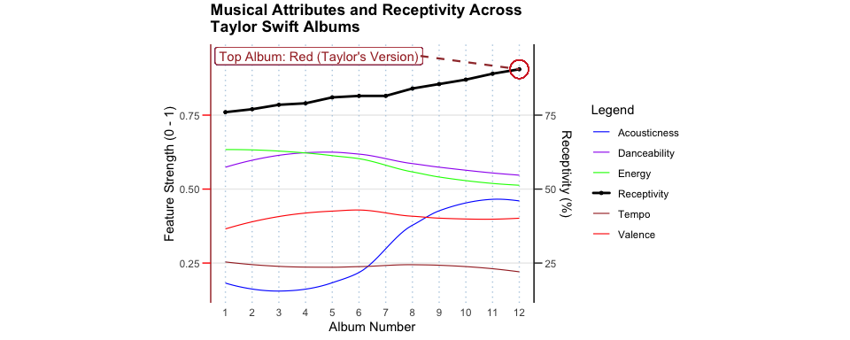

DSA2101 Group Project: Analysis of Taylor Swift Spotify Data
================

## Group members

``` r
students <- data.frame(
  Group_Members = c("Chua Yong Sheng Joel", "Lim Zeen Kiat", "Robin Ghosh", "Timothy Teo Shao Jun"),
  Matriculation_Number = c("A0282307H", "A0273151M", "A0271671A", "A0272851B")
)

kable(students, col.names = c("Group Members", "Matriculation Number"))
```

| Group Members        | Matriculation Number |
|:---------------------|:---------------------|
| Chua Yong Sheng Joel | A0282307H            |
| Lim Zeen Kiat        | A0273151M            |
| Robin Ghosh          | A0271671A            |
| Timothy Teo Shao Jun | A0272851B            |

## Loading Data

``` r
# Load the Taylor Swift datasets
tuesdata <- tidytuesdayR::tt_load(2023, week = 42)
```

    ## ---- Compiling #TidyTuesday Information for 2023-10-17 ----
    ## --- There are 3 files available ---
    ## 
    ## 
    ## ── Downloading files ───────────────────────────────────────────────────────────
    ## 
    ##   1 of 3: "taylor_album_songs.csv"
    ##   2 of 3: "taylor_all_songs.csv"
    ##   3 of 3: "taylor_albums.csv"

``` r
taylor_album_songs <- tuesdata$taylor_album_songs
taylor_all_songs <- tuesdata$taylor_all_songs
taylor_albums <- tuesdata$taylor_albums

# Save each dataset to new CSV files
# write.csv(taylor_album_songs, "taylor_album_songs.csv", row.names = FALSE)
# write.csv(taylor_all_songs, "taylor_all_songs.csv", row.names = FALSE)
# write.csv(taylor_albums, "taylor_albums.csv", row.names = FALSE)
```

=======

## 1. Introduction

Taylor Swift’s music has had a significant impact on the global pop and
country music scenes. In this project, we used the Taylor Swift Spotify
data sourced from the TidyTuesday repository to analyse the musical and
lyrical features of her music. This dataset includes detailed audio
attributes of her songs which we aim to use. By exploring the given
data, we aim to discover the patterns that have emerged throughout
Taylor Swift’s career and gain insights into how her music has evolved.

For our project, we aim to answer the following question:

``` bash
How do musical and lyrical features evolve across Taylor Swift's albums, and what insights can we gain about the progression of her artistry over time?
```

This analysis will allow us to identify trends in musical
characteristics and examine how stylistic changes have corresponded with
different stages of her career. By doing so, we hope to provide a deeper
understanding of how Taylor Swift has redefined her career and connect
with a global audience.

## 2. Data Cleaning & Summary

### Summary of relevant statistics

The following table contains a brief description of the variables we
have chosen to use for our project:

``` r
track_attributes <- data.frame(
  Variable = c(
    "album_name", "album_release", "track_name", "danceability", "energy", 
    "loudness", "mode", "speechiness", "acousticness", "instrumentalness", 
    "liveness", "valence", "tempo", "explicit"
  ),
  Class = c(
    "character", "double", "character", "double", "double", "double", "integer",
    "double", "double", "double", "double", "double", "double", "logical"
  ),
  Description = c(
    "Name of the album the track belongs to.",
    "Release date of the album.",
    "Name of the individual track.",
    "Measures how suitable a track is for dancing.",
    "Measures the intensity and activity of a track, with higher values indicating more energetic sounds.",
    "The overall volume of the track, measured in decibels (dB).",
    "This is also a categorical variable. It indicates the modality of the track: 1 for major, 0 for minor.",
    "Measures the presence of spoken words in a track, with higher values indicating more speech-like content.",
    "Represents the likelihood that the track is acoustic, with higher values indicating more acoustic qualities.",
    "Predicts whether a track is instrumental, with higher values suggesting a lack of vocals.",
    "Measures the presence of an audience in the recording, with higher values indicating a stronger likelihood that the track is live",
    "Describes the musical positiveness conveyed, with higher values indicating more cheerful and happy tones.",
    "The speed of the track, measured in beats per minute (BPM).",
    "Indicates whether the track contains explicit content: 1 for explicit, 0 otherwise."
  )
)
kable(track_attributes, col.names = c("Variable", "Class", "Description"), align = "l")
```

| Variable | Class | Description |
|:---|:---|:---|
| album_name | character | Name of the album the track belongs to. |
| album_release | double | Release date of the album. |
| track_name | character | Name of the individual track. |
| danceability | double | Measures how suitable a track is for dancing. |
| energy | double | Measures the intensity and activity of a track, with higher values indicating more energetic sounds. |
| loudness | double | The overall volume of the track, measured in decibels (dB). |
| mode | integer | This is also a categorical variable. It indicates the modality of the track: 1 for major, 0 for minor. |
| speechiness | double | Measures the presence of spoken words in a track, with higher values indicating more speech-like content. |
| acousticness | double | Represents the likelihood that the track is acoustic, with higher values indicating more acoustic qualities. |
| instrumentalness | double | Predicts whether a track is instrumental, with higher values suggesting a lack of vocals. |
| liveness | double | Measures the presence of an audience in the recording, with higher values indicating a stronger likelihood that the track is live |
| valence | double | Describes the musical positiveness conveyed, with higher values indicating more cheerful and happy tones. |
| tempo | double | The speed of the track, measured in beats per minute (BPM). |
| explicit | logical | Indicates whether the track contains explicit content: 1 for explicit, 0 otherwise. |

### Data cleaning

We’ll start off by filtering for the features listed above which we want
to keep:

``` r
taylor_album_songs <- taylor_album_songs %>%
    select(album_name, album_release, track_name, danceability, energy, loudness, mode, speechiness, acousticness, instrumentalness, liveness, valence, tempo, explicit)

taylor_all_songs <- taylor_all_songs %>%
    select(album_name, album_release, track_name, danceability, energy, loudness, mode, speechiness, acousticness, instrumentalness, liveness, valence, tempo, explicit)

taylor_albums <- taylor_albums %>%
    select(!ep)
```

Then, we group the data by their respective albums for aggregating album
data:

``` r
taylor_album_songs <- taylor_album_songs %>%
  group_by(album_name)

taylor_all_songs <- taylor_all_songs %>%
  group_by(album_name)

taylor_albums <- taylor_albums %>%
  group_by(album_name)
```

We will check and remove NA values in the data, which are not needed for
our visualisations:

``` r
taylor_album_songs_na_count <- sapply(taylor_album_songs, function(x) sum(is.na(x)))
print(taylor_album_songs_na_count)
```

    ##       album_name    album_release       track_name     danceability 
    ##                0                0                0                3 
    ##           energy         loudness             mode      speechiness 
    ##                3                3                3                3 
    ##     acousticness instrumentalness         liveness          valence 
    ##                3                3                3                3 
    ##            tempo         explicit 
    ##                3                3

``` r
taylor_all_songs_na_count <- sapply(taylor_all_songs, function(x) sum(is.na(x)))
print(taylor_all_songs_na_count)
```

    ##       album_name    album_release       track_name     danceability 
    ##               27               27                0               11 
    ##           energy         loudness             mode      speechiness 
    ##               11               11               11               11 
    ##     acousticness instrumentalness         liveness          valence 
    ##               11               11               11               11 
    ##            tempo         explicit 
    ##               11               11

``` r
taylor_albums_na_count <- sapply(taylor_albums, function(x) sum(is.na(x)))
print(taylor_albums_na_count)
```

    ##       album_name    album_release metacritic_score       user_score 
    ##                0                0                2                2

``` r
taylor_album_songs <- taylor_album_songs %>%
    na.omit()

taylor_all_songs <- taylor_all_songs %>%
    na.omit()

taylor_albums <- taylor_albums %>%
    na.omit()
```

To ensure that the visualisation representations are balanced, we will
check the range of the various song features to see whether there is a
need to scale the features:

``` r
# Checking range of values (for all the songs) of numerical variables in taylor_all_songs
ranges_taylor_all_songs <- taylor_all_songs %>%
  ungroup() %>%
  select(liveness:tempo) %>%
  summarise(across(liveness:tempo, ~paste(min(.), "to", max(.))))
glimpse(ranges_taylor_all_songs)
```

    ## Rows: 1
    ## Columns: 3
    ## $ liveness <chr> "0.0357 to 0.594"
    ## $ valence  <chr> "0.0382 to 0.942"
    ## $ tempo    <chr> "68.534 to 208.918"

``` r
# Checking range of values of numerical variables in taylor_album_songs
ranges_taylor_album_songs <- taylor_album_songs %>%
  select(liveness:tempo) %>%
  summarise(across(liveness:tempo, ~paste(min(.), "to", max(.))))
```

    ## Adding missing grouping variables: `album_name`

``` r
glimpse(ranges_taylor_album_songs)
```

    ## Rows: 10
    ## Columns: 4
    ## $ album_name <chr> "1989", "Fearless (Taylor's Version)", "Lover", "Midnights"…
    ## $ liveness   <chr> "0.0658 to 0.341", "0.0667 to 0.343", "0.0637 to 0.319", "0…
    ## $ valence    <chr> "0.107 to 0.942", "0.13 to 0.797", "0.166 to 0.865", "0.038…
    ## $ tempo      <chr> "92.008 to 184.014", "80.132 to 200.391", "68.534 to 207.47…

Loudness is measured in decibels, which has a logarithmic scale. To
enable a clearer visual representation, we will first convert the values
of loudness to a linear scale, before scaling the values between 0 and
1.

``` r
# Scaling loudness for taylor_all_songs
taylor_all_songs <- taylor_all_songs %>%
  ungroup() %>%
  mutate(loudness = 10^(loudness/10)) #%>%
  #mutate(normalised_intensity = (intensity - min(intensity)) / (max(intensity) - min(intensity)))
glimpse(taylor_all_songs)
```

    ## Rows: 238
    ## Columns: 14
    ## $ album_name       <chr> "Taylor Swift", "Taylor Swift", "Taylor Swift", "Tayl…
    ## $ album_release    <date> 2006-10-24, 2006-10-24, 2006-10-24, 2006-10-24, 2006…
    ## $ track_name       <chr> "Tim McGraw", "Picture To Burn", "Teardrops On My Gui…
    ## $ danceability     <dbl> 0.580, 0.658, 0.621, 0.576, 0.418, 0.589, 0.479, 0.59…
    ## $ energy           <dbl> 0.491, 0.877, 0.417, 0.777, 0.482, 0.805, 0.578, 0.62…
    ## $ loudness         <dbl> 0.2258396, 0.6168790, 0.2022553, 0.5151100, 0.2649110…
    ## $ mode             <dbl> 1, 1, 1, 1, 1, 1, 1, 1, 0, 1, 1, 1, 1, 1, 1, 1, 1, 1,…
    ## $ speechiness      <dbl> 0.0251, 0.0323, 0.0231, 0.0324, 0.0266, 0.0293, 0.029…
    ## $ acousticness     <dbl> 0.57500, 0.17300, 0.28800, 0.05100, 0.21700, 0.00491,…
    ## $ instrumentalness <dbl> 0.00e+00, 0.00e+00, 0.00e+00, 0.00e+00, 0.00e+00, 0.0…
    ## $ liveness         <dbl> 0.1210, 0.0962, 0.1190, 0.3200, 0.1230, 0.2400, 0.084…
    ## $ valence          <dbl> 0.425, 0.821, 0.289, 0.428, 0.261, 0.591, 0.192, 0.50…
    ## $ tempo            <dbl> 76.009, 105.586, 99.953, 115.028, 175.558, 112.982, 1…
    ## $ explicit         <lgl> FALSE, FALSE, FALSE, FALSE, FALSE, FALSE, FALSE, FALS…

``` r
# Scaling loudness for taylor_album_songs
taylor_album_songs <- taylor_album_songs %>%
  mutate(loudness = 10^(loudness/10)) #%>%
  #mutate(normalised_intensity = (intensity - min(intensity)) / (max(intensity) - min(intensity)))
glimpse(taylor_album_songs)
```

    ## Rows: 191
    ## Columns: 14
    ## Groups: album_name [10]
    ## $ album_name       <chr> "Taylor Swift", "Taylor Swift", "Taylor Swift", "Tayl…
    ## $ album_release    <date> 2006-10-24, 2006-10-24, 2006-10-24, 2006-10-24, 2006…
    ## $ track_name       <chr> "Tim McGraw", "Picture To Burn", "Teardrops On My Gui…
    ## $ danceability     <dbl> 0.580, 0.658, 0.621, 0.576, 0.418, 0.589, 0.479, 0.59…
    ## $ energy           <dbl> 0.491, 0.877, 0.417, 0.777, 0.482, 0.805, 0.578, 0.62…
    ## $ loudness         <dbl> 0.2258396, 0.6168790, 0.2022553, 0.5151100, 0.2649110…
    ## $ mode             <dbl> 1, 1, 1, 1, 1, 1, 1, 1, 0, 1, 1, 1, 1, 1, 1, 1, 1, 1,…
    ## $ speechiness      <dbl> 0.0251, 0.0323, 0.0231, 0.0324, 0.0266, 0.0293, 0.029…
    ## $ acousticness     <dbl> 0.57500, 0.17300, 0.28800, 0.05100, 0.21700, 0.00491,…
    ## $ instrumentalness <dbl> 0.00e+00, 0.00e+00, 0.00e+00, 0.00e+00, 0.00e+00, 0.0…
    ## $ liveness         <dbl> 0.1210, 0.0962, 0.1190, 0.3200, 0.1230, 0.2400, 0.084…
    ## $ valence          <dbl> 0.425, 0.821, 0.289, 0.428, 0.261, 0.591, 0.192, 0.50…
    ## $ tempo            <dbl> 76.009, 105.586, 99.953, 115.028, 175.558, 112.982, 1…
    ## $ explicit         <lgl> FALSE, FALSE, FALSE, FALSE, FALSE, FALSE, FALSE, FALS…

Finally, the cleaned data are saved as new files for us to reference
later on:

``` r
write.csv(taylor_album_songs, "CSV files/taylor_album_songs_cleaned.csv", row.names = FALSE)
write.csv(taylor_all_songs, "CSV files/taylor_all_songs_cleaned.csv", row.names = FALSE)
write.csv(taylor_albums, "CSV files/taylor_albums_cleaned.csv", row.names = FALSE)
```

### Data engineering

``` r
head(taylor_album_songs)
```

    ## # A tibble: 6 × 14
    ## # Groups:   album_name [1]
    ##   album_name   album_release track_name       danceability energy loudness  mode
    ##   <chr>        <date>        <chr>                   <dbl>  <dbl>    <dbl> <dbl>
    ## 1 Taylor Swift 2006-10-24    Tim McGraw              0.58   0.491    0.226     1
    ## 2 Taylor Swift 2006-10-24    Picture To Burn         0.658  0.877    0.617     1
    ## 3 Taylor Swift 2006-10-24    Teardrops On My…        0.621  0.417    0.202     1
    ## 4 Taylor Swift 2006-10-24    A Place In This…        0.576  0.777    0.515     1
    ## 5 Taylor Swift 2006-10-24    Cold As You             0.418  0.482    0.265     1
    ## 6 Taylor Swift 2006-10-24    The Outside             0.589  0.805    0.393     1
    ## # ℹ 7 more variables: speechiness <dbl>, acousticness <dbl>,
    ## #   instrumentalness <dbl>, liveness <dbl>, valence <dbl>, tempo <dbl>,
    ## #   explicit <lgl>

``` r
head(taylor_all_songs)
```

    ## # A tibble: 6 × 14
    ##   album_name   album_release track_name       danceability energy loudness  mode
    ##   <chr>        <date>        <chr>                   <dbl>  <dbl>    <dbl> <dbl>
    ## 1 Taylor Swift 2006-10-24    Tim McGraw              0.58   0.491    0.226     1
    ## 2 Taylor Swift 2006-10-24    Picture To Burn         0.658  0.877    0.617     1
    ## 3 Taylor Swift 2006-10-24    Teardrops On My…        0.621  0.417    0.202     1
    ## 4 Taylor Swift 2006-10-24    A Place In This…        0.576  0.777    0.515     1
    ## 5 Taylor Swift 2006-10-24    Cold As You             0.418  0.482    0.265     1
    ## 6 Taylor Swift 2006-10-24    The Outside             0.589  0.805    0.393     1
    ## # ℹ 7 more variables: speechiness <dbl>, acousticness <dbl>,
    ## #   instrumentalness <dbl>, liveness <dbl>, valence <dbl>, tempo <dbl>,
    ## #   explicit <lgl>

``` r
head(taylor_albums)
```

    ## # A tibble: 6 × 4
    ## # Groups:   album_name [6]
    ##   album_name   album_release metacritic_score user_score
    ##   <chr>        <date>                   <dbl>      <dbl>
    ## 1 Taylor Swift 2006-10-24                  67        8.5
    ## 2 Fearless     2008-11-11                  73        8.4
    ## 3 Speak Now    2010-10-25                  77        8.6
    ## 4 Red          2012-10-22                  77        8.5
    ## 5 1989         2014-10-27                  76        8.2
    ## 6 reputation   2017-11-10                  71        8.3

``` r
names(taylor_album_songs)==names(taylor_all_songs)
```

    ##  [1] TRUE TRUE TRUE TRUE TRUE TRUE TRUE TRUE TRUE TRUE TRUE TRUE TRUE TRUE

``` r
checking_conflicts <- taylor_album_songs %>% anti_join(taylor_all_songs, by=names(taylor_all_songs))
head(checking_conflicts)
```

    ## # A tibble: 0 × 14
    ## # Groups:   album_name [0]
    ## # ℹ 14 variables: album_name <chr>, album_release <date>, track_name <chr>,
    ## #   danceability <dbl>, energy <dbl>, loudness <dbl>, mode <dbl>,
    ## #   speechiness <dbl>, acousticness <dbl>, instrumentalness <dbl>,
    ## #   liveness <dbl>, valence <dbl>, tempo <dbl>, explicit <lgl>

All the column names match for both tables. A tibble of no elements was
generated, thus confirming that all rows are present in either tables.
Since we can choose which table we want, we will use taylor_album_songs.

Next, since we are trying to compare popularity statistics by album, we
need to check which albums are present in `taylor_album_songs` and
`taylor_albums`.

``` r
names1 <- taylor_albums %>% select(album_name) %>% unique() %>% arrange(album_name)
names2 <- taylor_album_songs %>% select(album_name) %>% unique() %>% arrange(album_name)

comp_table=left_join(names1, names2, by=c("album_name"))

combined_table = rep(NA,length(comp_table$album_name))

for (i in 1:length(names1$album_name) ){
  if (names1$album_name[i] %in% names2$album_name) {
    combined_table[i] <- comp_table$album_name[i]
  }
}

combined_table = cbind(names1$album_name,combined_table)
knitr::kable(combined_table, col.names = c("Taylor Albums","Taylor Album Songs"), caption="Comparison of album names between the tables")
```

| Taylor Albums               | Taylor Album Songs          |
|:----------------------------|:----------------------------|
| 1989                        | 1989                        |
| Fearless                    | NA                          |
| Fearless (Taylor’s Version) | Fearless (Taylor’s Version) |
| Lover                       | Lover                       |
| Midnights                   | Midnights                   |
| Red                         | NA                          |
| Red (Taylor’s Version)      | Red (Taylor’s Version)      |
| Speak Now                   | Speak Now                   |
| Taylor Swift                | Taylor Swift                |
| evermore                    | evermore                    |
| folklore                    | folklore                    |
| reputation                  | reputation                  |

Comparison of album names between the tables

Checking the table generated, Fearless and Red do not appear in Taylor
Album Songs, thus they will not be considered for popularity comparison.
Next, we will aggregate statistics for each of the musical attributes by
taking their mean. Then, we will combine `taylor_album_songs` and
`taylor_albums` to tie the popularity metrics with each common album.

``` r
taylor_album_summary <- taylor_album_songs %>% group_by(album_name)%>% summarize(
  mean_loudness = mean(loudness),
  mean_danceability = mean(danceability),
  mean_liveness = mean(liveness),
  mean_energy = mean(energy),
  mean_mode = round(mean(mode)),
  mean_speechiness = mean(speechiness),
  mean_acousticness = mean(acousticness),
  mean_instrumentalness = mean(instrumentalness),
  mean_valence = mean(valence),
  mean_tempo = mean(tempo)
) %>% inner_join(taylor_albums, by=c("album_name")) %>% relocate(album_release, .after=album_name)
```

Overall Metacritic scores and user scores are representative of the
popularity of the albums because they are the “weighted average” of the
albums’ individual scores from critics and the public respectively
(Metacritic, 2023).

While the Metacritic score ranges from 0 to 100 (Metacritic, 2023), the
user score has a different range of 0 to 10 which we noticed when
exploring the “user reviews” section (Metacritic, n.d.). We will
aggregate these into one statistic, “Popularity”, weighted by their
respective ranges.

Hence we use the following formula: Popularity =
(metacritic_score+(user_score\*10))/2

``` r
taylor_albums_cleaned <- read.csv("CSV files/taylor_albums_cleaned.csv")
taylor_albums_cleaned <- taylor_albums_cleaned %>% mutate(Popularity = (metacritic_score+user_score*10)/2)
taylor_albums_cleaned
```

    ##                     album_name album_release metacritic_score user_score
    ## 1                 Taylor Swift    2006-10-24               67        8.5
    ## 2                     Fearless    2008-11-11               73        8.4
    ## 3                    Speak Now    2010-10-25               77        8.6
    ## 4                          Red    2012-10-22               77        8.5
    ## 5                         1989    2014-10-27               76        8.2
    ## 6                   reputation    2017-11-10               71        8.3
    ## 7                        Lover    2019-08-23               79        8.4
    ## 8                     folklore    2020-07-24               88        9.0
    ## 9                     evermore    2020-12-11               85        8.9
    ## 10 Fearless (Taylor's Version)    2021-04-09               82        8.9
    ## 11      Red (Taylor's Version)    2021-11-12               91        9.0
    ## 12                   Midnights    2022-10-21               85        8.3
    ##    Popularity
    ## 1        76.0
    ## 2        78.5
    ## 3        81.5
    ## 4        81.0
    ## 5        79.0
    ## 6        77.0
    ## 7        81.5
    ## 8        89.0
    ## 9        87.0
    ## 10       85.5
    ## 11       90.5
    ## 12       84.0

## 3. Visualisations

### a. What are the most significant features?

This visualisation focuses on the distribution of musical feature values
for Taylor Swift’s songs using a violin and box plot. These plots allow
us to visually assess each feature’s distribution and spread, helping us
pinpoint those with a higher variance, as they likely contribute more
significantly to her musical style. By focusing on features that show
the widest range (i.e. most diverse expressions) across her songs, we
can identify the more significant attributes that make her music unique.
We will use these features in the next visualisation to examine their
possible relationship with Swift’s popularity.

``` r
library(ggthemes)
x_labels = c("Acousticness", "Danceability", "Energy", "Instrumentalness", "Liveness", "Loudness", "Speechiness", "Valence")
taylor_long = taylor_album_songs %>% select(-mode) %>% pivot_longer(danceability:valence, values_to = "values", names_to = "labels") %>%
  mutate(labels = as.factor(labels))
ggplot(taylor_long, aes(y=labels, x=values, fill = labels)) +
  geom_violin(show.legend = F, alpha=0.5, bw=0.08, color = F) +
  geom_boxplot(show.legend = F, alpha=0.6, fill = "lightblue", outlier.fill = "lightblue", width = 0.4) +
  theme_economist() +
  labs(y= "", x = "Magnitude (From 0 to 1)", title = "Boxplot of musical features for Swift's songs") +
  scale_y_discrete(labels = x_labels) +
  theme(
    axis.text.x = element_text(size = 6), 
    axis.text.y = element_text(size = 8),
    axis.title.x = element_text(vjust=-1, size=10),
    plot.title = element_text(size=16),
    aspect.ratio = 0.4,
    plot.background = element_rect(fill = "#fae7d7")
  )
```

<!-- -->

``` r
library(ggthemes)
x_labels = c("Acousticness", "Danceability", "Energy", "Instrumentalness", "Liveness", "Loudness", "Speechiness", "Valence")
taylor_long = taylor_album_songs %>% select(-mode) %>% pivot_longer(danceability:valence, values_to = "values", names_to = "labels") %>%
  mutate(labels = as.factor(labels))
ggplot(taylor_long, aes(y=labels, x=values, fill = labels)) +
  geom_violin(show.legend = F, alpha=0.55, bw=0.05) +
  theme_economist() +
  labs(y= "", x = "Magnitude (From 0 to 1)", title = "Violin plot of musical features for Swift's songs") +
  scale_y_discrete(labels = x_labels) +
  theme(
    axis.text.x = element_text(size = 6), 
    axis.text.y = element_text(size = 8),
    axis.title.x = element_text(vjust=-1, size=10),
    plot.title = element_text(size=16),
    aspect.ratio = 0.4
  )
```

<!-- -->

### b. How have the features we selected influenced Taylor Swift’s popularity?

We plan to investigate how the selected features with the most
variability (from part (a)) might impact Taylor Swift’s popularity
across her career. By plotting these features along with a line
representing her album popularity over time, we will be able to observe
patterns and potential correlations, thus revealing how changes in
certain musical characteristics might cause a shift in listener interest
and popularity.

``` r
ggplot(taylor_long %>% filter(labels %in% c("acousticness","valence","energy", "danceability")), aes(x=album_release, y=values, color=labels)) +
  geom_smooth(method = "loess",
              se = FALSE,
              formula = 'y ~ x',
              span = 0.8,
              size=1.2) +
  stat_smooth(se=FALSE, geom="area",
              method = 'loess', alpha=.1,
              span = 0.8,aes(fill=labels)) +

  geom_line(data = taylor_albums_cleaned,
            aes(x = as.Date(album_release), 
                y = Popularity/100,
                color = "Popularity"),
            size = 2, linetype = "solid", lineend="round") +
  
  scale_y_continuous(
    name = "Feature Values (0 - 1)",
    sec.axis = sec_axis(~ .*100,
                        name = "Popularity (%)")
  ) +
  labs(title = "Musical Attributes and Popularity Across Taylor Swift Albums",
       x = "Album Release Date", y = "Feature Values") +
  
  scale_color_manual(values = c("acousticness" = "blue", "valence" = "red", "energy" = "green", "danceability" = "purple", "Popularity" = "black")) +
  scale_fill_manual(values = c("acousticness" = "blue", "valence" = "red", "energy" = "green", "danceability" = "purple"), guide = "none") +
  
  theme_minimal() +
  theme(legend.position = "top",
  axis.line.y.right = element_line(colour = "Black"),
  axis.ticks.y.right = element_line(color="red"),
  axis.ticks.length.y.right=unit(.25, "cm"),
  axis.line.y.left = element_line(color="brown"),
  axis.ticks.y.left = element_line(color="red"),
  axis.ticks.length.y.left=unit(.25, "cm"),
  aspect.ratio=0.4)    
```

    ## Warning: Using `size` aesthetic for lines was deprecated in ggplot2 3.4.0.
    ## ℹ Please use `linewidth` instead.
    ## This warning is displayed once every 8 hours.
    ## Call `lifecycle::last_lifecycle_warnings()` to see where this warning was
    ## generated.

    ## `geom_smooth()` using formula = 'y ~ x'

<!-- -->

### c. Which feature(s) has/have the greatest impact on Taylor Swift’s songs?

We have chosen Swift’s most popular album to investigate this
subquestion. Here, we will examine how each feature contributes
proportionally to her songs. This stacked bar chart illustrates each
song’s feature makeup within the album, revealing which musical elements
are dominant in her songs and may have potentially driven their success.
This analysis complements the previous sections by showing the relative
importance of each feature in her highest-rated album.

``` r
#Finding her most popular album
most_popular_album <- taylor_albums_cleaned %>%
  arrange(desc(Popularity)) %>%
  head(1) %>%
  pull(album_name)

#Filtering the songs from her most popular album
most_popular_album_songs <- taylor_album_songs %>%
  filter(album_name==most_popular_album) %>%
  select(album_name,track_name,danceability,acousticness,energy,valence)

#Normalize the numerical features to scale them between 0 and 1 
scaled_songs <- most_popular_album_songs %>%
  mutate(across(danceability:valence, ~ (.-min(.)) / (max(.) - min(.)), .names = "scaled_{.col}"))

#Reshape the data into long format for plotting
scaled_songs_long <- scaled_songs %>%
  pivot_longer(cols = starts_with("scaled_"), 
               names_to = "feature", 
               values_to = "value") %>%
  mutate(feature = gsub("scaled_", "", feature)) %>%
  group_by(track_name) %>%
  mutate(total_value = sum(value),
         normalized_value = value / total_value) %>%
  ungroup()

#Check the mean value of each feature
feature_mean <- scaled_songs_long %>%
  select(feature, normalized_value) %>%
  group_by(feature) %>%
  summarize(mean = mean(normalized_value)) %>%
  arrange(mean) %>%
  pull(feature)

#Sort the feature column by mean value
scaled_songs_long <- scaled_songs_long %>%
  mutate(feature = factor(feature, levels = feature_mean))

# Create the plot
ggplot(scaled_songs_long, aes(x = normalized_value, y = track_name, fill = feature)) +
  geom_bar(stat = "identity", position = "stack") +
  theme_minimal() +
  labs(title = paste("Proportion of Significant Features of Songs in the Most Popular Album: ", most_popular_album),
       x = "Proportion of Normalised Features", y = "Songs",
       fill = "Feature") +
  theme(axis.text.y = element_blank(),plot.title = element_text(size = 11)) +
  scale_fill_brewer(palette = "Set3")
```

<!-- -->

## 4. Discussions

### a.

### b.

### c.

## 5. Teamwork

## 6. References

Harmon, J. (2023, October 16). Taylor Swift. GitHub.
<https://github.com/rfordatascience/tidytuesday/blob/master/data/2023/2023-10-17/readme.md>  
Metacritic. (2023). How do you compute METASCORES? Retrieved November 7,
2024, from
<https://metacritichelp.zendesk.com/hc/en-us/articles/14478499933079-How-do-you-compute-METASCORES>  
Metacritic. (n.d.). Taylor Swift by Taylor Swift.
<https://www.metacritic.com/music/taylor-swift/taylor-swift/user-reviews>
